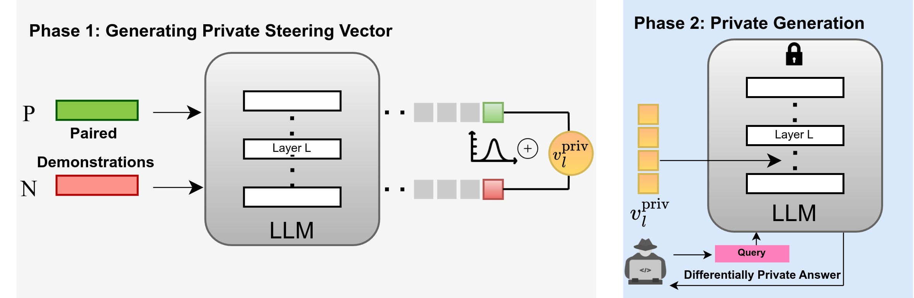

# PSA: Differentially Private Steering for LLM Alignment

[](https://put-here-your-paper.com)
[](https://opensource.org/licenses/Apache-2.0)
[](https://www.python.org/)
[](https://github.com/UKPLab/iclr2025-psa/actions/workflows/main.yml)

> **Abstract:**
> Aligning Large Language Models (LLMs) with human values and away from undesirable behaviors (such as hallucination) has become increasingly important. 
> Recently, steering LLMs towards a desired behavior via activation editing has emerged as an effective method to mitigate harmful  generations at inference-time. 
> Activation editing modifies LLM representations by preserving information from positive demonstrations (e.g., truthful) and minimising information from negative demonstrations (e.g., hallucinations). 
> When these demonstrations come from a private dataset, the aligned LLM may leak private information contained in those private samples. 
> In this work, we present the first study of aligning LLM behavior with private datasets. 
> Our work proposes the Private Steering for LLM Alignment (PSA) algorithm to edit LLM activations with differential privacy (DP) guarantees. 
> We conduct extensive experiments on seven different benchmarks with open-source LLMs of different sizes (0.5B to 7B) and model families (LlaMa, Qwen, Mistral and Gemma). 
> Our results show that PSA achieves DP guarantees for LLM alignment with minimal loss in performance, including alignment metrics, open-ended text generation quality, and general-purpose reasoning. 
> We also develop the first Membership Inference Attack (MIA) for evaluating and auditing the empirical privacy for the problem of LLM steering via activation editing. 
> Our attack is tailored for activation editing and relies solely on the generated texts without their associated probabilities. 
> Our experiments support the theoretical guarantees by showing improved guarantees for our PSA algorithm compared to several existing non-private techniques.
---
Contact person: [Anmol Goel](mailto:anmol.goel@tu-darmstadt.de) 

[UKP Lab](https://www.ukp.tu-darmstadt.de/) | [TU Darmstadt](https://www.tu-darmstadt.de/
)

Don't hesitate to send us an e-mail for issues or further questions.

---

### Our Framework


---

### :rocket: Getting Started :rocket:

```bash
# create a virtual environment (e.g. conda)
conda create -n dp-steering python=3.10
conda activate dp-steering

# Clone the repository
git clone https://github.com/UKPLab/iclr2025-psa.git

# Change working directory
cd iclr2025-psa

# install the requirements
pip install -r requirements.txt
```

---

### Private Steering

```bash
python run.py \
--model "meta-llama/Llama-2-7B-chat-hf" \
--dataset "Sycophancy" \
--layers 11 12 13 14 15 \   # the layers to be manipulated with PSA
--noise_multiplier 0.02     # controls the amount of random noise 
```

---

### GPT-4 Evals

We use the same code, evaluation setup and prompts as [CAA](https://github.com/nrimsky/CAA).


## Cite

Please use the following citation:

```
@inproceedings{goel-2025-psa,
      title={PSA: Differentially Private Steering for Large Language Model Alignment}, 
      author={Anmol Goel and Yaxi Hu and Iryna Gurevych and Amartya Sanyal},
      year={2025},
      publisher={arXiv}, 
}
```

## Disclaimer

> This repository contains experimental software and is published for the sole purpose of giving additional background details on the respective publication. 